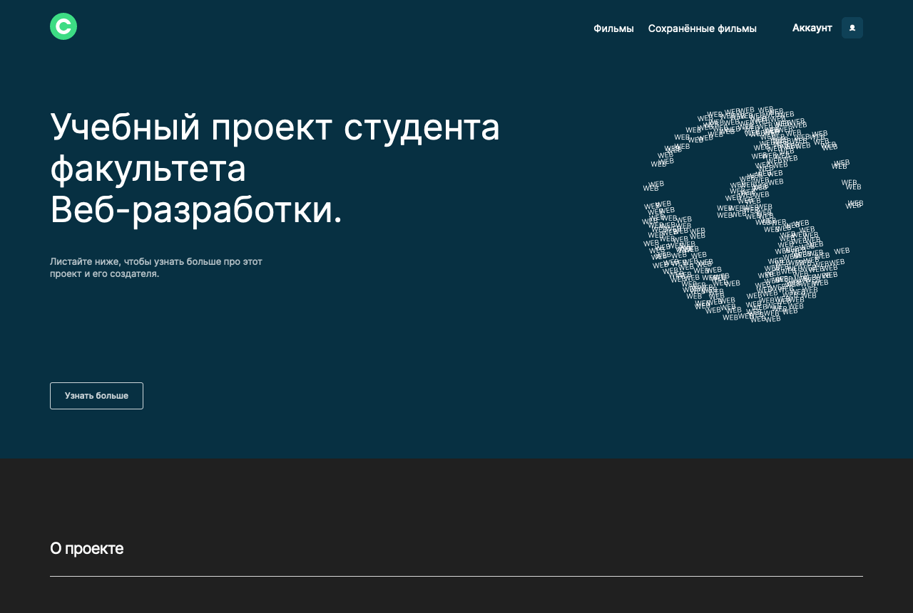
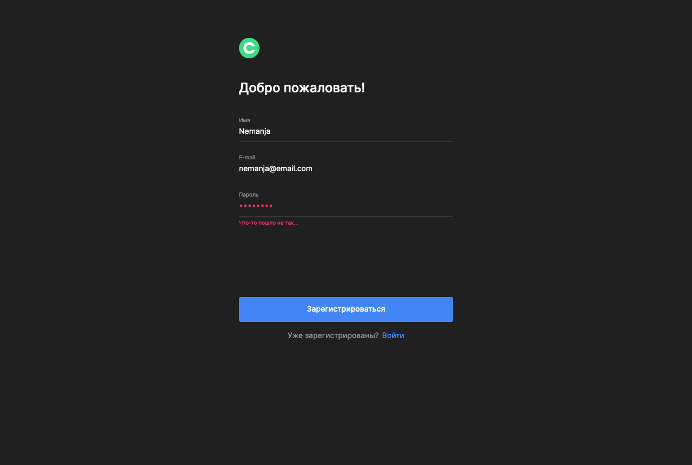
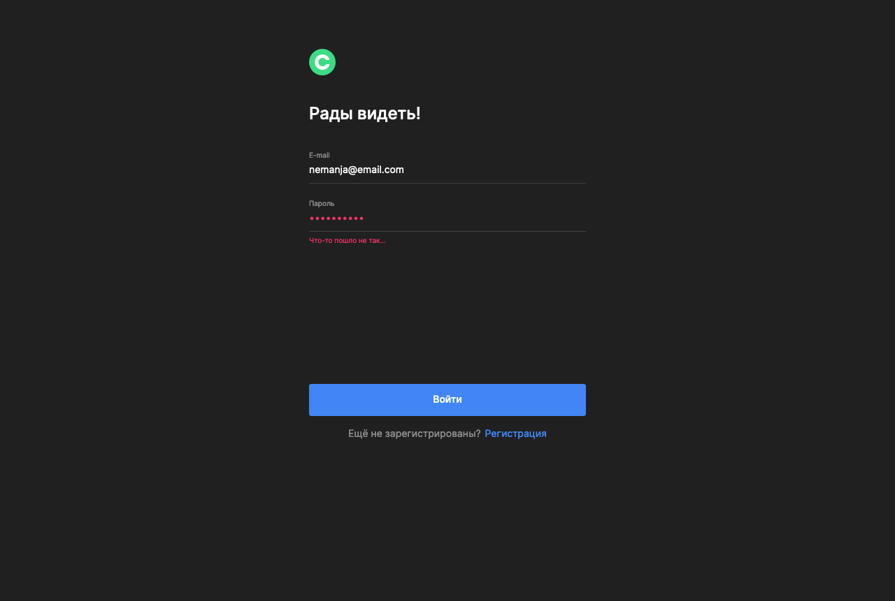
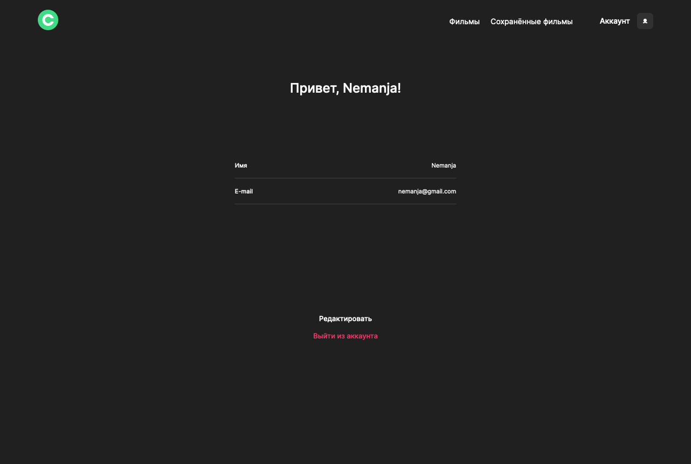
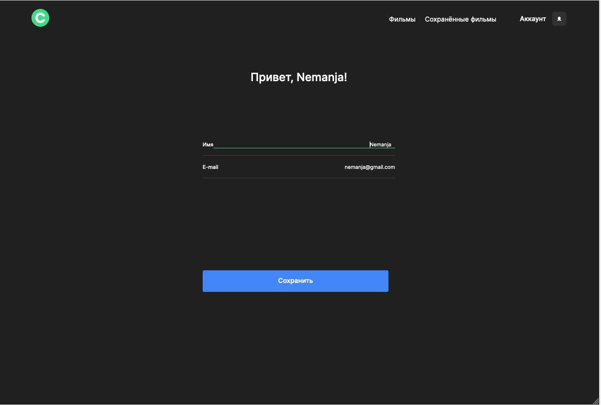
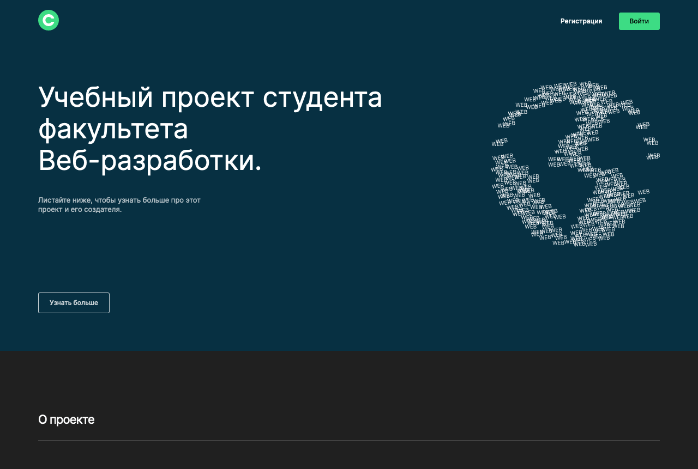
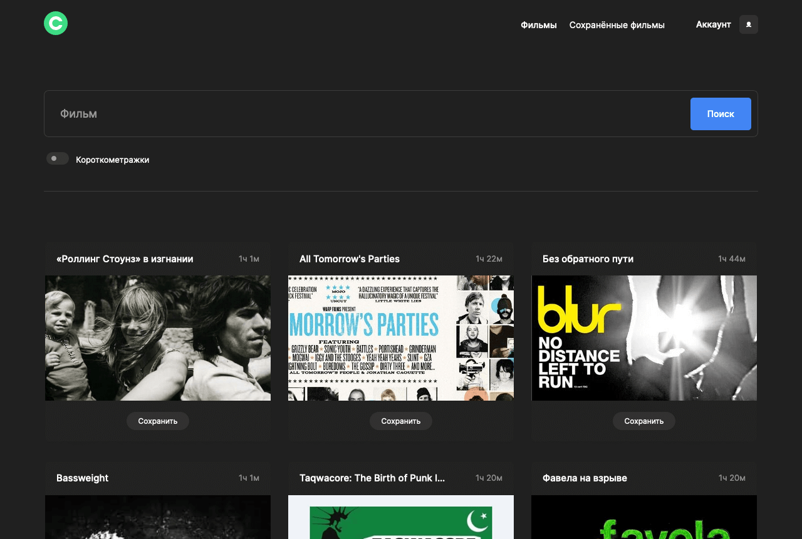
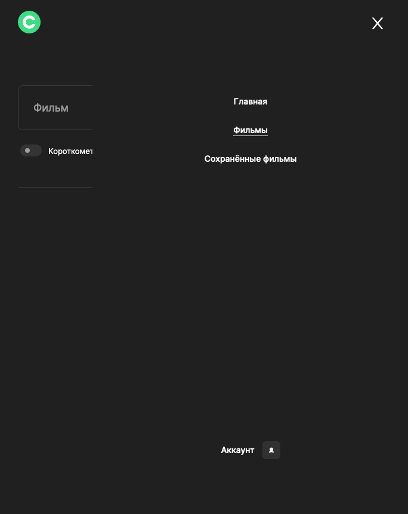
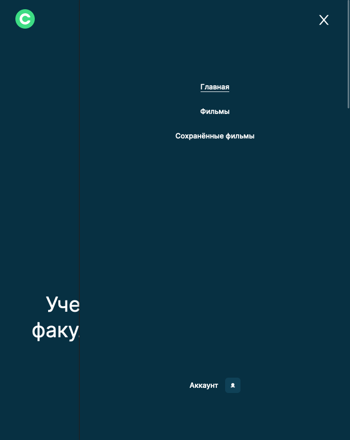

[![LinkedIn][linkedin-shield]][linkedin-url]

<!-- PROJECT LOGO -->
<br />
<div align="center">
  <a href="https://github.com/letStayFoolish/movies-explorer-frontend/">
    
  </a>

<h3 align="center">Movies Explorer App</h3>

  <p align="center">
    Frontend part for the Movies Explorer App based on React.
    Educational purpose project from <a href="https://practicum.yandex.ru/web/">Яндекс.Практикум</a>
    <br />
    <a href="https://github.com/letStayFoolish/movies-explorer-frontend/"><strong>Explore the docs »</strong></a>
    <br />
    <br />
    <a href="https://more-movies.nomoredom.nomoredomainsicu.ru/">View Demo</a>
    ·
    <a href="https://github.com/letStayFoolish/movies-explorer-frontend/issues">Report Bug</a>
    ·
    <a href="https://github.com/letStayFoolish/movies-explorer-frontend/issues">Request Feature</a>
  </p>
</div>


<!-- TABLE OF CONTENTS -->
<details>
  <summary>Table of Contents</summary>
  <ol>
    <li>
      <a href="#about-the-project">About The Project</a>
      <ul>
        <li><a href="#built-with">Built With</a></li>
      </ul>
    </li>
    <li>
      <a href="#getting-started">Getting Started</a>
      <ul>
        <li><a href="#prerequisites">Prerequisites</a></li>
        <li><a href="#installation">Installation</a></li>
      </ul>
    </li>
    <li><a href="#figma-design">Figma Design</a></li>
    <li><a href="#projects-checklists">Project's checklists</a></li>
    <li><a href="#license">License</a></li>
    <li><a href="#contact">Contact</a></li>
  </ol>
</details>


<!-- ABOUT THE PROJECT -->
## About The Project


<details><summary><b>Show all</b></summary>








</details>

`Project Description`

### Movies Explorer App

Movies Explorer App is a full-stack application developed using React as a Single Page Application (SPA). This project serves as an educational endeavor and is an integral part of the Yandex Practicum Educational Program for Web Development. This README file pertains to the frontend aspect of the project.

### Overview
The project comprises a main page that provides information about the current project and all previous projects completed during the 10-month duration of the educational program. Utilizing the latest React Router techniques, users can seamlessly navigate to various pages within the site.

### User Authentication
To access all available features and navigate to other pages, users must first log in if they have already registered or create an account if they are new to the platform.

### Movies Page
The Movies page displays a comprehensive collection of movies, along with their relevant information, such as title and duration. This data is fetched from the server via request-response mechanisms, with the server forming the backend component, which was developed in the initial phase of this project. Movies are dynamically displayed on the page upon successful retrieval, facilitated by RESTful API calls.

### Saving Movies
Users have the option to add movies to their list of favorite films by clicking the "Save" button. The "Saved Movies" page, one of the key features of the website, allows users to access their curated list of favorite movies. Users can further manage their list by removing movies through the use of the "X" symbol button.

### Profile Management
Lastly, the application includes a Profile page where users can customize their username and email settings to suit their preferences.

<p align="right">(<a href="#readme-top">back to top</a>)</p>


### Built With

* [![React][React.js]][React-url]

### Technologies:
### Frontend:

- HTML5;
- CSS3:
  - Flexbox;
  - Grid Layout;
  - Positioning;
  - Adaptive UI;
  - Media Queries;
- BEM methodology (nested/flat);
- JavaScript:
  - CamelCase style;
  - Object-oriented programming;
  - Promise, asynchronous functions;
  - API (Application Programming Interface);
- Webpack:
  - Project files are bundled using [Webpack](https://webpack.js.org/) technology, which takes the dependencies and generates a dependency graph allowing web developers to use a modular approach for their web application development purposes.
- React JS:
  - Create React App;
  - JSX;
  - Functional components;
  - Hooks.

<p align="right">(<a href="#readme-top">back to top</a>)</p>

<!-- GETTING STARTED -->
<!-- USAGE EXAMPLES -->
## Getting started

### Prerequisites

Before you can start using the Movies Explorer App, ensure you have the following prerequisites installed on your system:

**Node.js:** Make sure you have Node.js installed. You can download it [here](https://nodejs.org/en).

### Installation

1. Download repo - [click here](https://github.com/letStayFoolish/movies-explorer-frontend/)

2. Clone the Repository: Begin by cloning this repository to your local machine using the following command:
```sh
   git clone https://github.com/letStayFoolish/movies-explorer-frontend/
```

3. Navigate to the Directory: Change your current directory to the project folder:
```ssh
cd movies-explorer-app
```
4. Install Dependencies: Install the required dependencies using npm:
```ssh
npm install
```

### Running the Application

Once you have completed the installation process, you can run the Movies Explorer App:
1. Development Mode: To run the app in development mode, use the following command:
```ssh
npm start
```
This will start the development server, and you can access the app in your web browser at http://localhost:3000.

2. Production Build: To create a production-ready build of the app, use the following command:
```ssh
npm run build
```
This will generate optimized production files in the build directory.


### Accessing the Application

With the app running, you can now access its various features, including browsing movies, saving favorites, and managing your profile. Be sure to sign in or create an account to unlock all the app's functionalities.

Feel free to explore and enjoy the Movies Explorer App!

<p align="right">(<a href="#readme-top">back to top</a>)</p>


<!-- FIGMA -->
## Figma Design:

- [Figma: dark-4](https://www.figma.com/file/hxf4LV1dv2WQ2kh8ekIvyj/light-1?type=design&node-id=1-9662&mode=dev);

<p align="right">(<a href="#readme-top">back to top</a>)</p>


<!-- CHECKLISTS -->
## Project's checklists:

- [Checklist 3](https://code.s3.yandex.net/web-developer/static/new-program/web-diploma-criteria-2.0/checklist_jsx_diplom.pdf);
- [Checklist 4](https://code.s3.yandex.net/web-developer/static/new-program/web-diploma-criteria-2.0/checklist_react_diplom.pdf);

<p align="right">(<a href="#readme-top">back to top</a>)</p>


<!-- LICENSE -->
## License

````
This project is licensed under the Yandex Practicum License.
````
<hr>

Copyright (c) _2023_ _Nemanja Karaklajic_


<!-- CONTACT -->
## Contact

Nemanja Karaklajic

E-mail: [nemanjakaraklajic90@gmail.com](mailto:nemanjakaraklajic90@gmail.com)

Website: [nemanjakaraklajic.com](https://chilicode.netlify.app/)

LinkedIn profile: [linkedIn](https://twitter.com/twitter_handle)

Project Link: [https://github.com/letStayFoolish/movies-explorer-frontend/](https://github.com/letStayFoolish/movies-explorer-frontend/)

Pull request Link: [https://github.com/letStayFoolish/movies-explorer-frontend/pull/2](https://github.com/letStayFoolish/movies-explorer-frontend/pull/2)

<p align="right">(<a href="#readme-top">back to top</a>)</p>


<!-- MARKDOWN LINKS & IMAGES -->
<!-- https://www.markdownguide.org/basic-syntax/#reference-style-links -->
[contributors-shield]: https://img.shields.io/github/contributors/github_username/repo_name.svg?style=for-the-badge
[contributors-url]: https://github.com/github_username/repo_name/graphs/contributors
[forks-shield]: https://img.shields.io/github/forks/github_username/repo_name.svg?style=for-the-badge
[forks-url]: https://github.com/github_username/repo_name/network/members
[stars-shield]: https://img.shields.io/github/stars/github_username/repo_name.svg?style=for-the-badge
[stars-url]: https://github.com/github_username/repo_name/stargazers
[issues-shield]: https://img.shields.io/github/issues/github_username/repo_name.svg?style=for-the-badge
[issues-url]: https://github.com/github_username/repo_name/issues
[license-shield]: https://img.shields.io/github/license/github_username/repo_name.svg?style=for-the-badge
[license-url]: https://github.com/github_username/repo_name/blob/master/LICENSE.txt
[linkedin-shield]: https://img.shields.io/badge/-LinkedIn-black.svg?style=for-the-badge&logo=linkedin&colorB=555
[linkedin-url]: https://www.linkedin.com/in/nemanjakaraklajic30111990/
[product-screenshot]: images/screenshot.png
[Next.js]: https://img.shields.io/badge/next.js-000000?style=for-the-badge&logo=nextdotjs&logoColor=white
[Next-url]: https://nextjs.org/
[React.js]: https://img.shields.io/badge/React-20232A?style=for-the-badge&logo=react&logoColor=61DAFB
[React-url]: https://reactjs.org/
[Vue.js]: https://img.shields.io/badge/Vue.js-35495E?style=for-the-badge&logo=vuedotjs&logoColor=4FC08D
[Vue-url]: https://vuejs.org/
[Angular.io]: https://img.shields.io/badge/Angular-DD0031?style=for-the-badge&logo=angular&logoColor=white
[Angular-url]: https://angular.io/
[Svelte.dev]: https://img.shields.io/badge/Svelte-4A4A55?style=for-the-badge&logo=svelte&logoColor=FF3E00
[Svelte-url]: https://svelte.dev/
[Laravel.com]: https://img.shields.io/badge/Laravel-FF2D20?style=for-the-badge&logo=laravel&logoColor=white
[Laravel-url]: https://laravel.com
[Bootstrap.com]: https://img.shields.io/badge/Bootstrap-563D7C?style=for-the-badge&logo=bootstrap&logoColor=white
[Bootstrap-url]: https://getbootstrap.com
[JQuery.com]: https://img.shields.io/badge/jQuery-0769AD?style=for-the-badge&logo=jquery&logoColor=white
[JQuery-url]: https://jquery.com 
